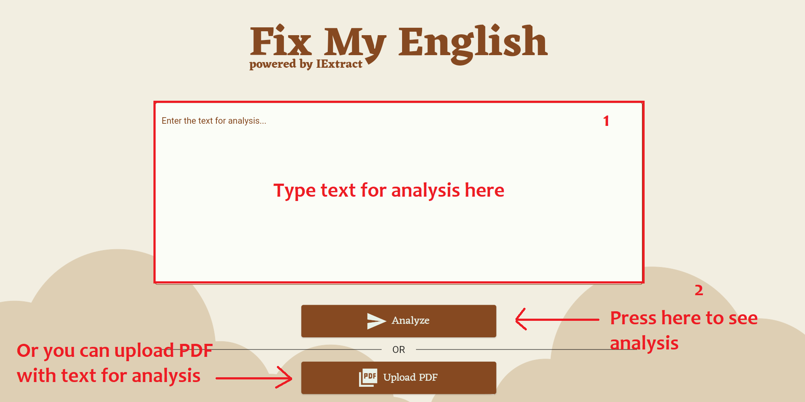
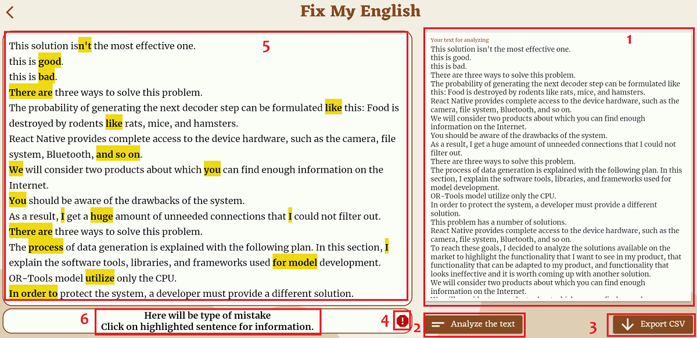
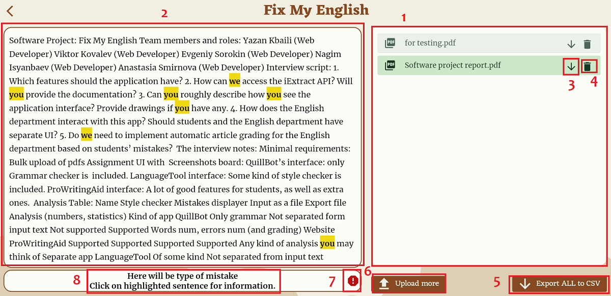

# Fix my English

## Description

Fix my English is a web app that can be used to analyze English academic writing style. It utilizes natural language processing techniques to analyze text and find academic writing mistakes. Then, mistakes are reported to the user with their appropriate description. The project also supports exporting reports of the mistakes in the form of CSV files. It is free and easy to use. Availability from Russia and unpaid are the main purposes for developing such applications.

## Demo


https://user-images.githubusercontent.com/39875672/176227612-e2cb4c0f-029f-4a7c-8c3f-78b1678ec1c3.mp4

You can visit website by this [link](https://fix-my-english-43ee2.web.app/).

## How to use
First of all go to this [website](https://fix-my-english-43ee2.web.app/).


(1 - text editor, 2 - anlyze again, 3 - export to CSV, 4 - report false issue, 5 - analysis view, 6 - description of mistake)

(1 - file list, 2 - analysis view, 3 - delete file, 4 - export file to CSV, 5 - export all files to CSV, 6 - upload more files, 7 - report false issue, 8 - description of mistake)


There are two main ways to use our project. Users can upload multiple pdf files to analyze writing in it. Users also can copy and paste the text into the text field. After that, the app should return the reports and show them to the user highlighting the mistakes. If the user wants to download the reports there is a button for that.


## Features

- Text analysis
- Comfortable interface for viewing the errors
- Multiple PDF files analysis
- Exporting CSV reports with all mistakes for one analysis or for all analyzes
- Reporting about false-positive mistakes to our API

## Project Installation

- Install [Flutter](https://docs.flutter.dev/get-started/install)
- Clone our project from GitHub
```console
git clone https://github.com/InnoSWP/fix_my_english_bs21_05
```
- Get dependecies
```console
flutter pub get
```
- If you want build web release, type following command
```console
flutter build web
```

## Frameworks or technology

- Flutter Web
- Firebase hosting and FireStore
- Python Flask for MockAPI

## Badges

[](https://poser.pugx.org/ali-irawan/xtra/license.svg)
[](https://img.shields.io/github/checks-status/InnoSWP/fix_my_english_bs21_05/master)


## License

MIT License

Copyright (c) 2022 Viktor Kovalev

Permission is hereby granted, free of charge, to any person obtaining a copy
of this software and associated documentation files (the "Software"), to deal
in the Software without restriction, including without limitation the rights
to use, copy, modify, merge, publish, distribute, sublicense, and/or sell
copies of the Software, and to permit persons to whom the Software is
furnished to do so, subject to the following conditions:

The above copyright notice and this permission notice shall be included in all
copies or substantial portions of the Software.

THE SOFTWARE IS PROVIDED "AS IS", WITHOUT WARRANTY OF ANY KIND, EXPRESS OR
IMPLIED, INCLUDING BUT NOT LIMITED TO THE WARRANTIES OF MERCHANTABILITY,
FITNESS FOR A PARTICULAR PURPOSE AND NONINFRINGEMENT. IN NO EVENT SHALL THE
AUTHORS OR COPYRIGHT HOLDERS BE LIABLE FOR ANY CLAIM, DAMAGES OR OTHER
LIABILITY, WHETHER IN AN ACTION OF CONTRACT, TORT OR OTHERWISE, ARISING FROM,
OUT OF OR IN CONNECTION WITH THE SOFTWARE OR THE USE OR OTHER DEALINGS IN THE
SOFTWARE.

